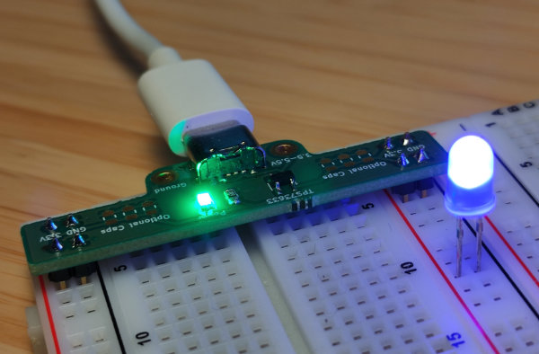

# PowerCB

PowerCB is a small PCB to power a breadboard with 3.3V. It has a small footprint to avoid blocking pins on the breadboard. The measurements fit an ELEGOO breadboard, but should work with other brands as well. It can be either used on the side of the breadboard to power one side only *or* in the middle to bridge all power lines. The board can be powered through USB-C or the two mounting holes, e.g. by connecting it to a power supply. It is based on a [TPS73633](http://www.ti.com/product/TPS73633-EP) low-dropout (LDO) linear voltage regulator. The optional 0805-capacitor pads can be used for additional bypass capacitors.

This board was designed using [KiCad 6.0](http://www.kicad.org).

## Design

## BOM
Reference | Part        | Description
--------- | ----------- | ---
U1        | <a href="https://www.mouser.de/ProductDetail/595-TPS73633DBVR/">TPS73633DBVR</a> | 3.3V LDO Voltage Regulator
U2        | <a href="https://www.mouser.de/ProductDetail/CUI-Devices/UJC-HP-3-SMT-TR?qs=vmHwEFxEFR%252BLRSV%252Bufrn1g%3D%3D">UJC-HP-3-SMT-TR</a> | USB Type C receptacle
R1        | 0805 Resistor     | Resistor for LED (680 Ω)
R2        | 0805 Resistor     | USB-C pulldown resistor (5.1 kΩ)
R3        | 0805 Resistor     | USB-C pulldown resistor (5.1 kΩ)
D1        | 0805 LED          | Power-on status
C1-6      | 0805 Capacitor    | Optional capacitors
J6-9      | Male Pin Header   | 2.54mm spacing

## License
 This work is licensed under a <a rel="license" href="http://creativecommons.org/licenses/by/4.0/">Creative Commons Attribution 4.0 International License</a>.
